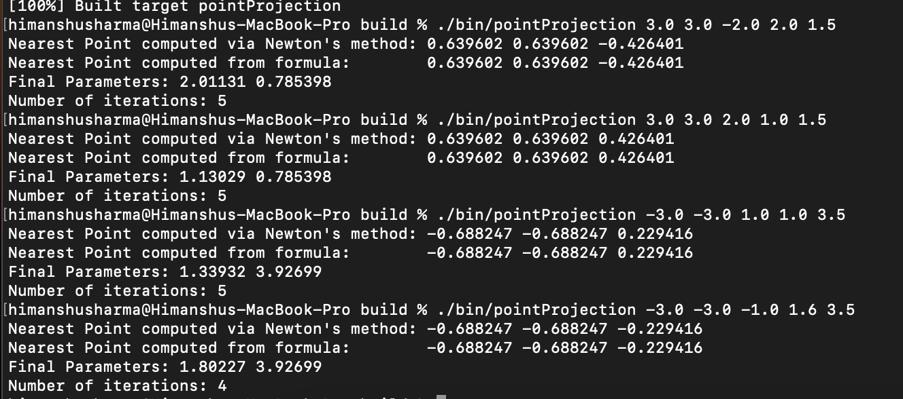

Computing Nearest Point on a BREP using Newton's method

We implemented Newton's algorithm to compute the nearest point on a unit sphere centered at 0. The program takes 5 doubles as input. The first three represent a point whose projection is to be found and the last two are initial guesses in terms of 

The program is only a draft and is neither rigorous, nor has been thoroughly debugged.

TODO:

1. Check how to restrict parameters to within domain while updating them.
2. Implement check to ascertain that hessian is positive.
